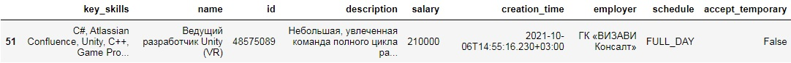
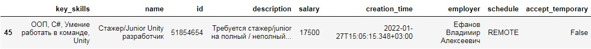
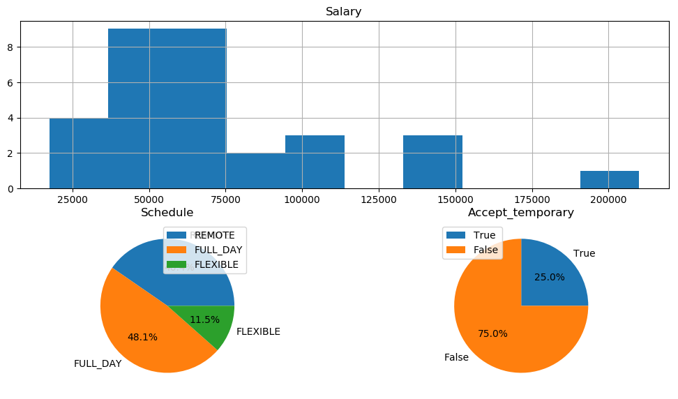
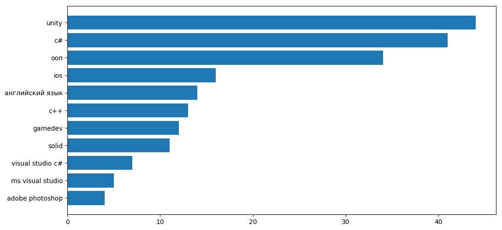
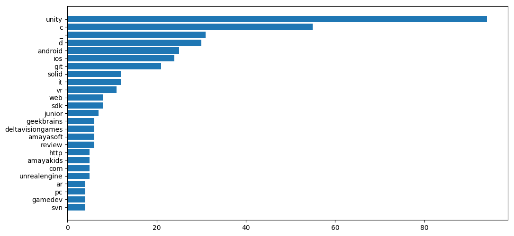

# hh_ru_research
Проект реализован в учебных целях анализа рынка труда, в особенности по hh.ru

## Input data
В качестве входных данных используются сериализованные json объекты вакансий, расположенные в json/  
Для их генерации был использован парсер: [a link](https://github.com/LuaSavage/hh_ru_parser)
Последующие ячейки кода преобразуют эти json объекты в pandas dataframe.  
Dataframe'ы сохраняются в csv/ и могут быть использованы повторно  

## Output data
В качестве выходных данных можно получить следующее:
* Поисковой текст
* Средняя зарплата
* Медианная зарплата
* Среднеквадратичное отклонение зарплаты
* Число вакансий
* Число вакансий с открытой зарплатой
    + в абсолютных значениях
    + в относительных значениях  
* Число вакансий без нижней или верхней границы зарплаты:
    + в абсолютных значениях
    + в относительных значениях      
* Вакансии с максимальной зарплатой  

* Вакансии с минимальной зарплатой  

* Гистограмма распределения зарплат  

* Круговые диаграммы графика работы и наличия возможности временного трудоустройства
* Анализ списка технологий по ключевым навыкам

* Анализ списка технологий по описанию

